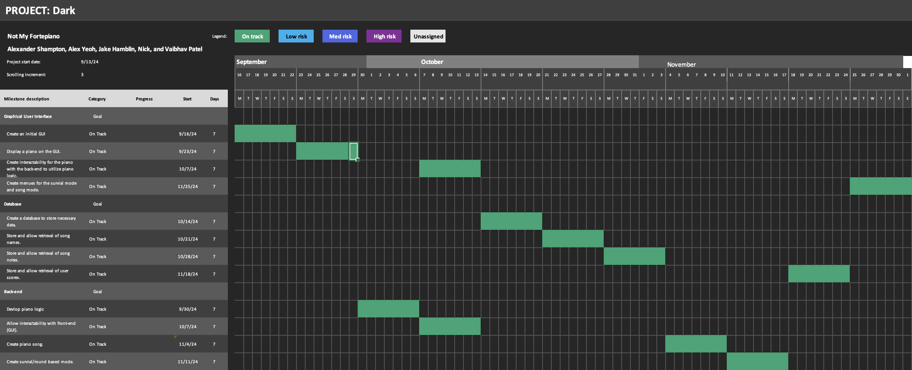

# Software Development Plan

### Communication Plan

- Meeting Location: Online on Discord
- Meeting Time: 12:00PM - 1:30PM
- Meeting Cadence: Saturday and Sunday

- Communication mechanism(s) for outside of meetings: Discord

We anticipate communicating via Discord outside of meetings. We have committed to responding within `1hr` timeframe.

## Timeline

- MVSs: A GUI application that displays an piano and is playable.
- Milestones (i.e., "Checkins"):
  - 9/22: Display a GUI
  - 9/29: Display a piano
  - 10/6: Create piano logic
  - 10/13: Create interactability for the piano between the front and back end.
  - 11/10: Create a piano song/music database
  - 11/17: Create piano round-based mode, Survival (Bop-It mode)
  - 12/1: Create different play options menu (survival/song choice) for GUI
- Requirement Specification
  - 9/22: A GUI shall be created.
  - 9/29: A piano shall be displayed on the GUI.
  - 10/13: A piano shall be interactable on the GUI.
- Design Specification
  - 9/22: A GUI shall be created.
  - 9/29: A piano shall be displayed on the GUI.
  - 10/13: A piano shall be interactable on the GUI.
