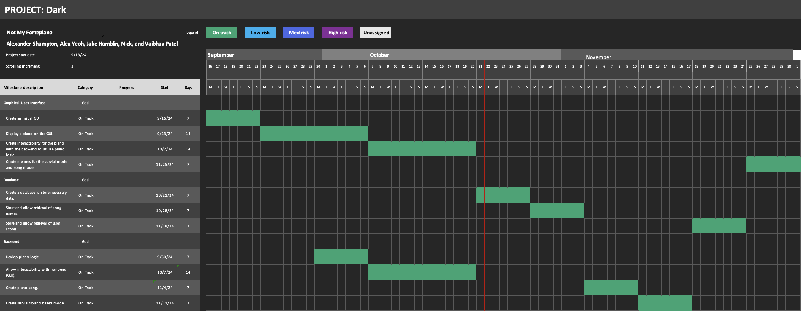

# Software Development Plan

### Communication Plan

- Meeting Location: Online on Discord
- Meeting Time: 12:00PM - 1:30PM
- Meeting Cadence: Saturday and Sunday

- Communication mechanism(s) for outside of meetings: Discord

We anticipate communicating via discord outside of meetings. We have commited to responding within `1hr` timeframe.

## Timeline

- MVSs: A GUI application that displays an `instrument` and is playable.
- Milestones (i.e., "Checkins"):
  - 9/22: Display a GUI
  - 9/29: Display an `instrument`
  - 10/6: Create `instrument` logic
  - 10/13: Create interactability for the `instrument` between the front and back end.
  - 11/10: Create a `instrument` music/song
  - 11/17: Create `instrument` round based mode, Survial (bop-it mode)
  - 12/1: Create different play options menu (survial/song choose) for gui
- Requirement Specification
  - 9/22: A GUI shall be created.
  - 9/29: A `instrument` shall be displayed on the GUI.
  - 10/13: A `instrument` shall be interactable on the GUI.
- Design Specification
